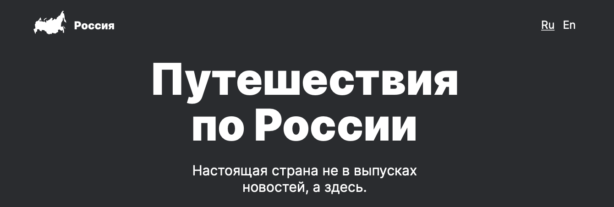

# Проект 3: Путешествие по России

Ссылка на проект: **https://bichurines.github.io/russian-travel/**

## Описание проекта
Это проект о путешествиях по России, которые стали очень актуальными в последнее время.

Содержит перечень самых интересных мест с описанием и фото, также есть возможность изучить дополнительную информацию по ссылкам на сторонние ресурсы.

Ориентирован на просмотр с любого устройства.

## Используемые технологии:
* __HTML5__
  * Семантические тэги
  * Валидная разметка
* __CSS__
  * Адаптивный сайт под все возможные экраны (контрольные точки и промежуточные состояния)
  * Построение сеток с помощью flex и grid
  * Позиционирование сложных элементов
* __БЭМ__
  * Все классы названы в соответствии с БЭМ
  * Создана файловая структура по модели nested, все блоки разбиты по отдельным папкам, элементы и модификаторы находятся в папках блоков по собственным разделам
